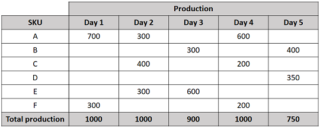
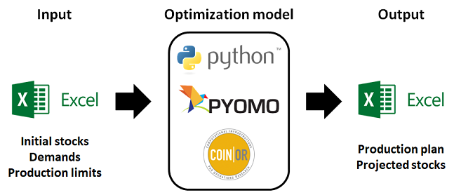

This project was developed to help plan the production of cellulose pulp at a large manufacturing line.

The company currently produces around 35 different types of pulp, each represented by an SKU. They vary in size, thickness, and proportion of pinus and eucalyptus fibers, among other features.

Given a list of demands, the current stock, and the production capacity, the goal is to schedule the production in a way that satisfies all demands (or as much as possible) with the least number of production batches.

The following toy example illustrates the situation (all values are in tons of material).

To calculate the stock at the end of a given day, we take the stock of the previous day, add the production, and subtract the demand.

Consider, for example, SKU A, which has an initial stock of 200 tons.

If 600 tons are produced on Day 1, the demand of 800 tons will be fulfilled, and the stock at the end of the day will be zero. Then, on Day 2, another 400 tons will be needed to fulfill the demand.

Another option is to produce 1,000 tons (the maximum allowed) of SKU A on Day 1 and fulfill the demand for this product for the first two days. This would be desirable because there would be only one batch produced. However, there would not be enough room to produce SKU F on Day 1, and its demand would not be fulfilled.

As one can imagine, there are many different ways to schedule the production, some of which may fulfill the demand, and some that may not.

Using the tool developed in this project to calculate the production plan, we get the following result.

This plan fulfills all demands with the minimum number of batches possible, namely 12 batches. Moreover, the stock at the end of Day 5 is zero for all SKUs.

The tool has an Excel interface, where the user inputs the data for initial stock, demands, and production capacities. The model is built using Pyomo and solved with CBC. The results are then fed back into the same Excel file.

In a real scenario, the number of SKUs is around 20, and the number of days can be up to 30. The entire optimization process usually finishes in a few minutes.

This project contributed to the company in a number of aspects:

maximum fulfillment of the demand
minimization of the number of production batches
huge reduction of the analyst's workload (before, planning was done manually by trial and error on a spreadsheet)
The tool is used on a weekly basis to plan the production of around 40,000 tons of cellulose pulp monthly.
